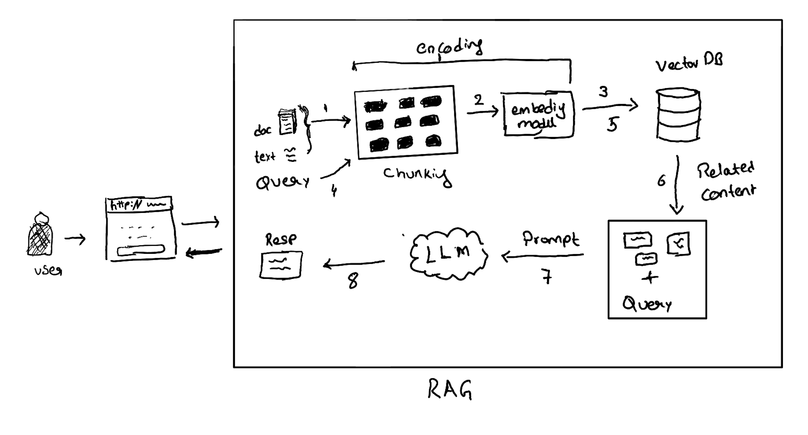

# QueryHive 🧠✨
A RAG application built for quering day to day needs

#### Features:
 * Support of openAI & Opensource LLM
 * Chuncking/Embedding - cost effective
 * cache for LLM - cost effective
 * Enabling upload for large documents and data
 * CLI options
 * Scalability 


 > Audience: Tech/Business (with basic sofware experience)

### Design:



#### Tech Stack:

* UI - ELM
* Backend Services - Rust/Python
* VectorDB - Elastic
* LLM - Opensource/OpenAPI


#### Setup:

1. Make sure you have docker installed
2. clone the project to local
    ```cmd
    git clone https://github.com/Karuturirs/QueryHive.git
    ```
3. ```cd QueryHive  ```
4. Start all applications
    ```cmd
    ./start_queryhive.sh
    ```
    > [UI Link](http://localhost:3002/src/Main.elm)
    > [Backend Link](http://localhost:3001/api/liveness)
5. Stop all applications
    ```cmd 
    ./stop_queryhive.sh
    ```


#### Other setups


pip install sentence-transformers transformers openai tiktoken nltk


cargo add pyo3 --features "extension-module"
cargo add pyo3 --features "auto-initialize"


export RUST_LOG=info  # This will enable logs at info level and higher
cargo run

docker run -p 127.0.0.1:9200:9200 -d --name hive-es \
  -e "discovery.type=single-node" \
  -e "xpack.security.enabled=false" \
  -e "xpack.license.self_generated.type=basic" \
  -v "elasticsearch-data:/usr/share/elasticsearch/data" \
  docker.elastic.co/elasticsearch/elasticsearch:8.15.0

